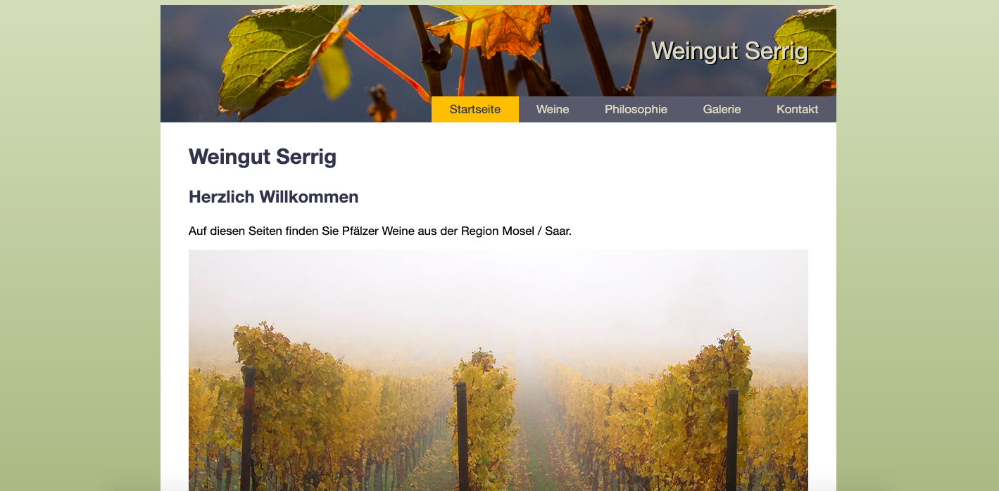

# VHS-HMTL-CSS-Kurs

HTML/CSS course taken in the "Volkshochschule Berlin" in January 2018.

Technologies used: HTML, CSS, Javascript

Can be viewed here on Heroku: https://vhs-html-css-kurs.herokuapp.com/

